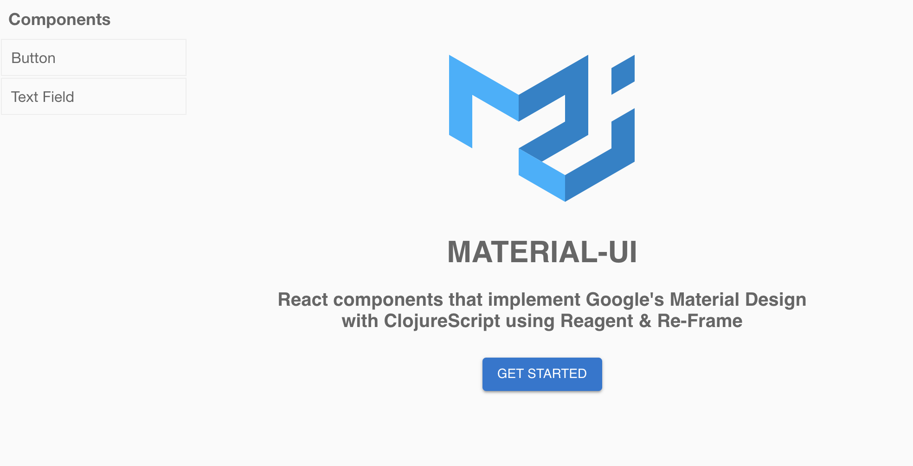

# Lesson 3

Unlike major sports, eSports is still a phenomenon on the fringe. Unless you play the games, you probably aren't aware of the live tournaments, the millions in prize money, and the players who dedicate their lives to the game.

Gamers have a potato stereotype but many hardcore athletes. What if there work outs could fuel and influence their favourite game?


* [Reagent](https://github.com/reagent-project/reagent)
* [Re-frame](https://github.com/Day8/re-frame)
* [Material UI](https://material-ui.com/)
* [Buddy](https://github.com/funcool/buddy)
* [Clj-Strava](https://github.com/ekimber/clj-strava)
* [PostgreSQL, DBeaver, & Heroku](http://thebar.cc/connecting-dbeaver-to-a-heroku-postgres-database/)



## Getting Started


To work on the front end:
```
lein figwheel
```

In dev, there is a big API problem between communication between figwheel and the ring server. We need to figure out [figwheel can start the ring server](https://github.com/bhauman/lein-figwheel/tree/master/examples/using-ring-handler) which seems straight forward.

To work on the back end:
```
lein ring server
```

## Demo

[live demo](https://intense-eyrie-34041.herokuapp.com/)

## Contributing

This is great opportunity to learn Reagent, Re-frame and Material-UI as a group.

Please use the demo-template.cljs to create your component demo and it the list in sidebar.cljs file.

## Deployment to Heroku

Copy this example folder into a new directory outside of this git repo so that it has it own git repo. We don't want to have nested repos. A future improvement would to have a build script that would automatically move it.

!! Copy and paste this folder into a new directory outside of this project repo !!


1. View the project the browser which also compiles necessary files that are later built in the uberjar

```
lein figwheel
```

2. Create the uberjar

```
lein with-profile -dev,+production uberjar
```

3. Deploy to Heroku

```
heroku login
git init
git add .
git commit -m "first commit"
heroku create
git push heroku master
heroku ps:scale web=1
heroku open
```

Note: because you moved this into a new directory, you shouldn't have a problem but if you happen to have github repo too you will need to add heroku. After you do the step `heroko create` you will need to add the heroku path `heroku git:remote -a radiant-falls-68370` replacing that radiant-falls-68370 with whatever heroku spit out for you.

Then open your browser whatever url it created ie: https://glacial-badlands-20785.herokuapp.com/

## Dev Credit

* [clojure & postgres recipe](https://github.com/clojure-cookbook/clojure-cookbook/blob/master/06_databases/6-03_manipulating-an-SQL-database.asciidoc)
* [json to clojure and vice versa](https://stackoverflow.com/questions/3436216/how-to-map-clojure-code-to-and-from-json)
* [compojure creating responses](https://github.com/ring-clojure/ring/wiki/Creating-responses)
* [compojure & ring](https://github.com/magomimmo/modern-cljs/blob/master/doc/first-edition/tutorial-03.md)
* [using a ring handler with figwheel](https://github.com/bhauman/lein-figwheel/tree/master/examples/using-ring-handler)
* [lock-key](https://github.com/clavoie/lock-key)
* [buddy](https://github.com/funcool/buddy)
* [caesium](https://github.com/lvh/caesium)
* [Exploring Java AES encryption algorithm with Clojure](http://jyliao.blogspot.com/2010/08/exploring-java-aes-encryption-algorithm.html)

## Dota2 Credit

* [Dota 2 Guide Competitive Positions](https://imperium.news/dota-2-guide-competitive-positions/)
* [Normal Person's Guide to Watching Dota2](https://www.polygon.com/2016/8/8/12401068/dota-2-watching-guide)
* [Dota 2 Logo](https://www.flaticon.com/free-icon/dota-2_588267)

## Clojure Roguelike

* [caves-of-clojure](http://stevelosh.com/blog/2012/07/caves-of-clojure-01/)
* [game-development-in-clojure](https://clojurefun.wordpress.com/2013/03/21/game-development-in-clojure-alchemy-7drl-post-mortem/)
* [Clojure rogue-like-like-like-like-like because why not?](https://github.com/aaron-santos/robinson)
